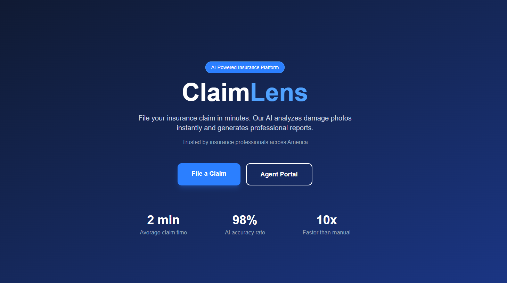
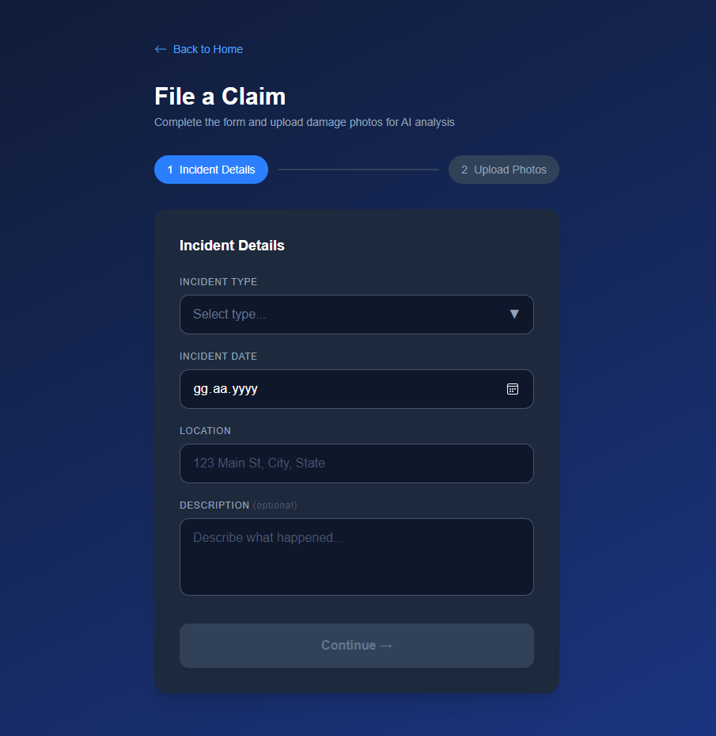
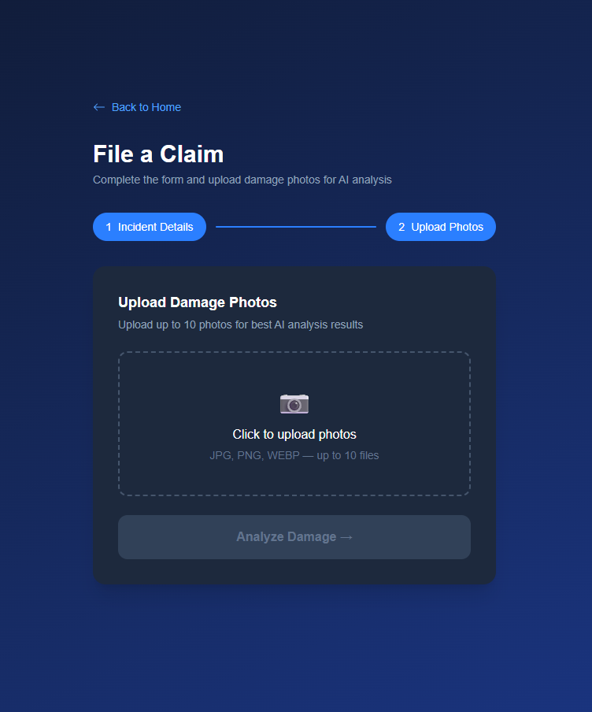
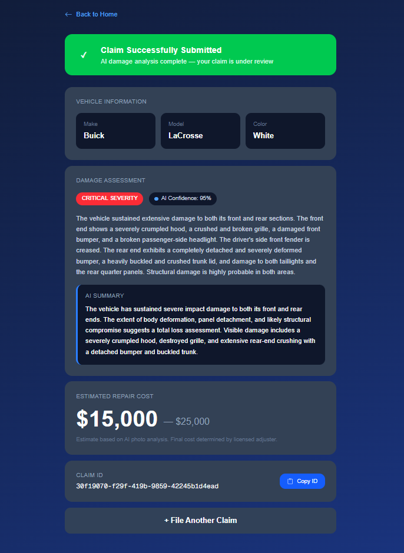
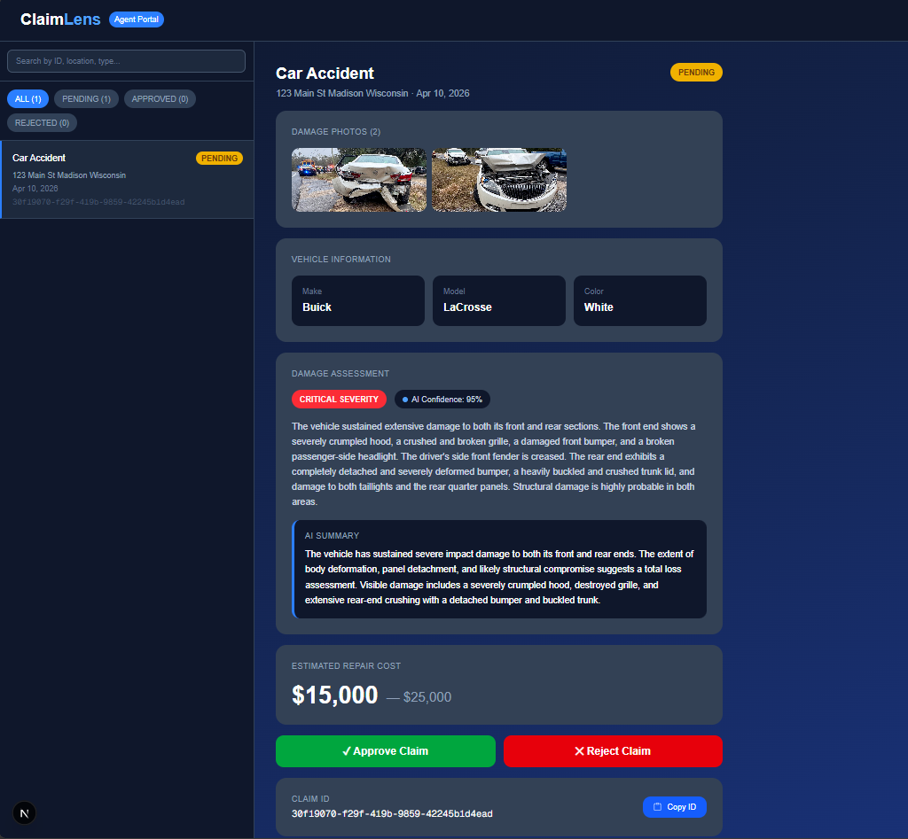

# ClaimLens 🔍

> AI-powered insurance claims processing platform

**See the damage. Skip the paperwork.**

## Screenshots







## What is ClaimLens?

ClaimLens automates the insurance claims process using AI. Customers upload damage photos, and Google Gemini Vision analyzes the damage instantly — detecting vehicle make/model, damage type, severity, and estimated repair cost. Insurance agents review AI-generated reports and approve or reject claims from a dedicated portal.

## Features

- 📸 **Multi-photo damage analysis** — Upload up to 10 photos for accurate AI assessment
- 🤖 **Google Gemini Vision AI** — Detects vehicle make, model, color, damage type and severity
- 💰 **Repair cost estimation** — Automatic cost range based on damage analysis
- 🏢 **Agent Portal** — Review claims, view photos with lightbox, approve or reject
- 🔍 **Search & Filter** — Search by ID, location, or type. Filter by status
- ☁️ **Cloud Storage** — Photos stored securely in Supabase Storage

## Tech Stack

| Layer | Technology |
|-------|-----------|
| Frontend | Next.js 14, TypeScript, Tailwind CSS |
| Backend | FastAPI, Python |
| AI | Google Gemini Vision |
| Database | PostgreSQL (Supabase) |
| Storage | Supabase Storage |

## Getting Started

### Backend
```bash
cd backend
python -m venv venv
venv\Scripts\activate
pip install -r requirements.txt
uvicorn app.main:app --port 8001
```

### Frontend
```bash
cd frontend
npm install
npm run dev
```

### Environment Variables

Create `backend/.env`:
DATABASE_URL=your_supabase_connection_string
GEMINI_API_KEY=your_google_gemini_api_key
SUPABASE_URL=your_supabase_project_url
SUPABASE_SERVICE_KEY=your_supabase_service_role_key

Create `frontend/.env.local`:
NEXT_PUBLIC_API_URL=http://localhost:8001

## Live Demo

- 🌐 Frontend: Coming soon
- 🔧 Backend: Coming soon